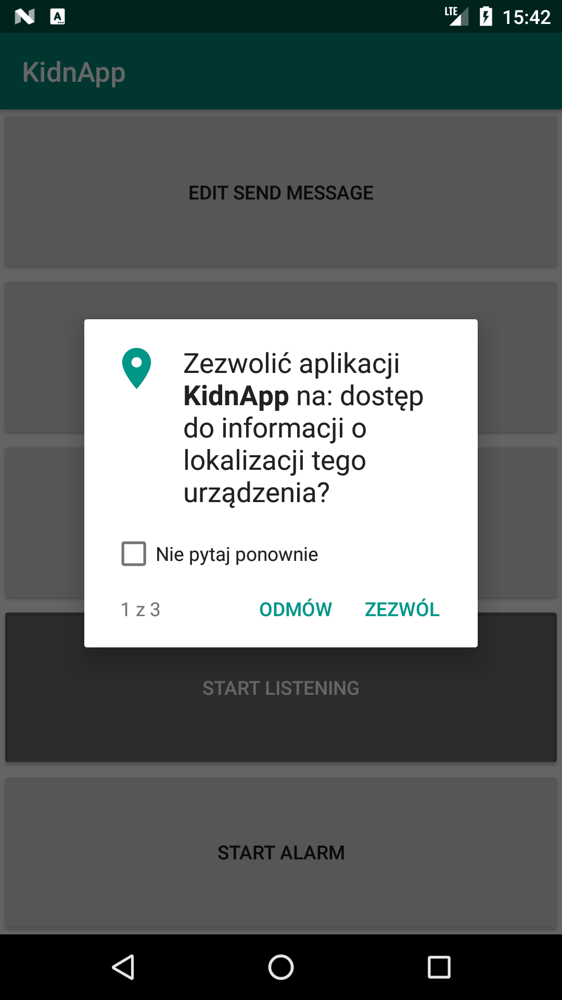
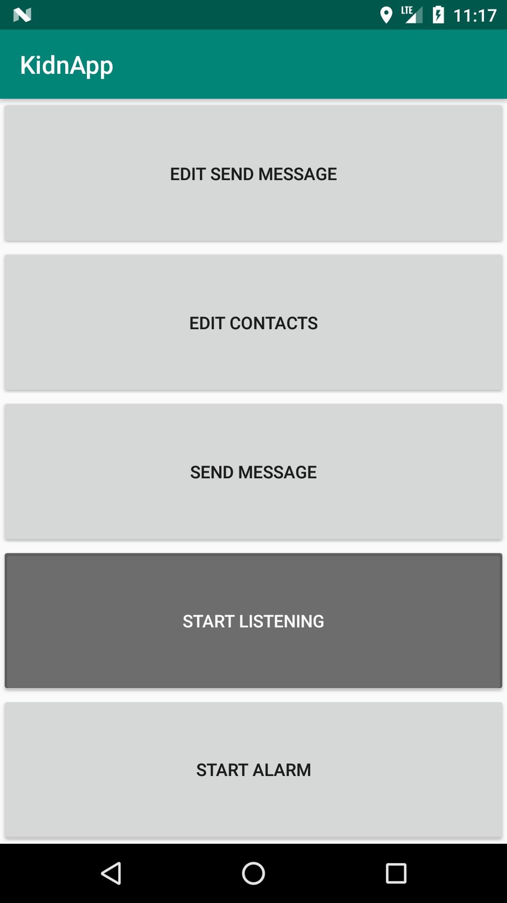
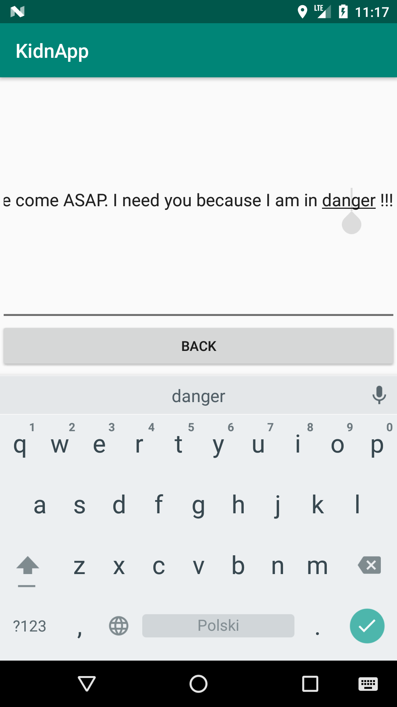
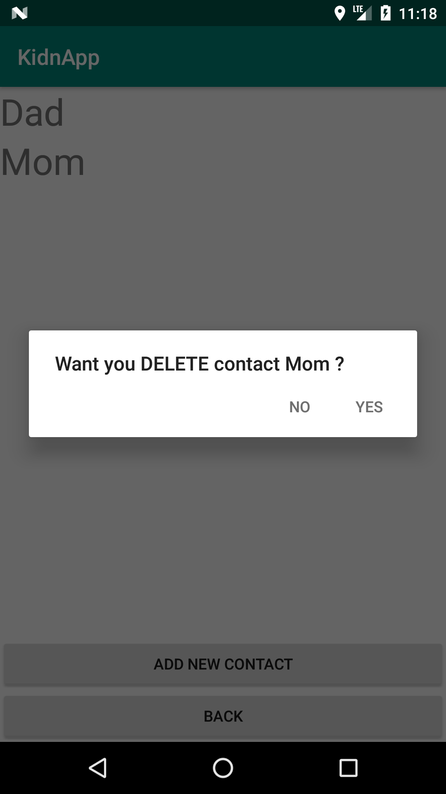
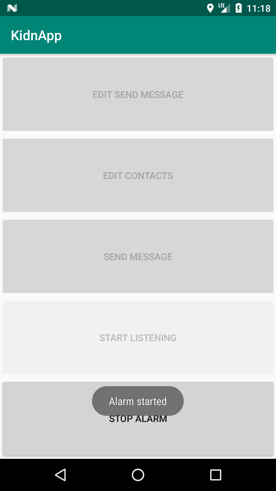
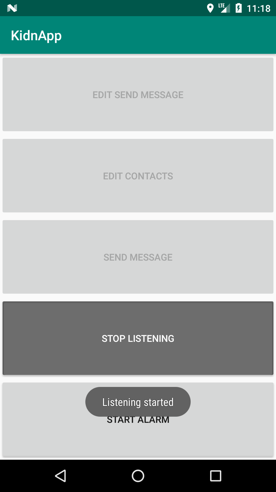

# KidnApp - Android Application
## Abstract
KidnApp can help you be more safe. When you are in danger you can press both the volume up and volume down buttons for eight seconds and it starts sending SMS with your localization and text message to your contacts every three minutes.
 
## technologies
- Java
- Android Studio
- Gradle

## Description
First you need to build and install this application. The best way to do it is to open this  project by Android Studio. In it there is a manager which helps you build and install project on your phone. Currently the application is not available in the official android store. The aim of creating this application was to increase safety. For properly working this application needs a few permissions listed below.
### Permissions

* Localization
* Contact
* Send message

## Tutorial
Let's assume that you installed the application correctly. In the first place when you open it you should see an acceptance permission form similar to the picture below. I've installed this app on my own phone that's why my form is in polish.

### Main menu
After you accept permissions you will see a main menu. It contains five buttons. Now you need to set your text message and choose the contacts which will receive your SMS.

### Set message in SMS
Press the EDIT SEND MESSAGE button and open the text editor. By default the message is "Please come ASAP. I need you because I am in danger !!!”. You should definitely change it.

### Choose your contacts
Next you need to choose contacts who should receive your message. When you press the EDIT CONTACTS button it will open the contacts manager. On the bottom of the screen you will see two buttons. The first one allows you to add new contacts to receivers and the second one redirects you to the Main screen of the application. 
To delete chosen contact by pressing it in the application manager.

### Test it
There are three ways to test the app. 
- You can just send a single message - click the SEND MESSAGE button. 
- Also you can trigger the procedure of sending a message every 3 minutes by clicking START ALARM.

- And you can finally press the START LISTENING button which start main functionality of application. Now the application will be working in background and listening for your action. When you press both the volume up and the volume down buttons for eight second it will be sending messages with localization and text every 3 minutes to chosen contacts. Then the only available button will be STOP ALARM

