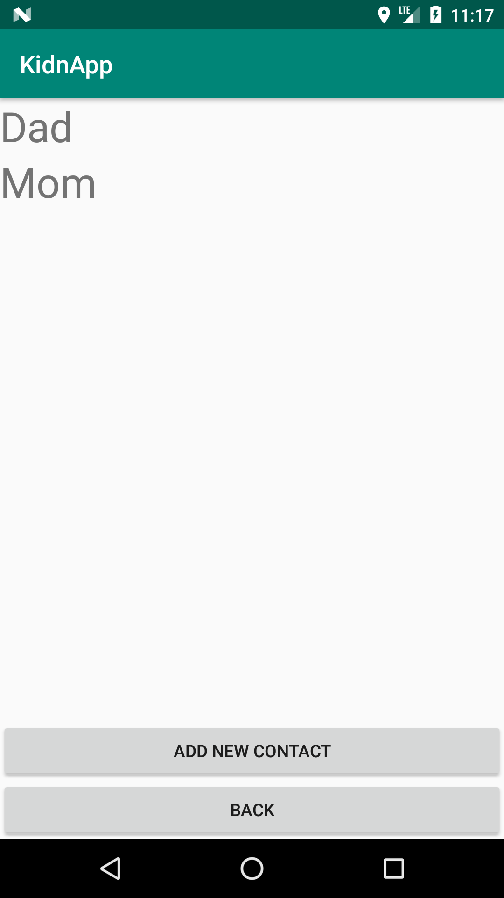

# KidnApp - Android Application
## Short description
Application KidnApp is intended to send text message and phone localization when a user is in danger. This application was made at one of study subject.  
## technologies
* Project was build in Android Studio
* Build by Gradle
## Long description
This part show how to use application.
### Permission
For correct operation you need to accept tree permission:
* Localization
* Contact
* Send message

### Main menu
Main menu is filled by five buttons. From this level you can access to 4 functionality.

### Edit message

### Edit contacts

### Just Send message 

### Start listening 

### Stop listening

